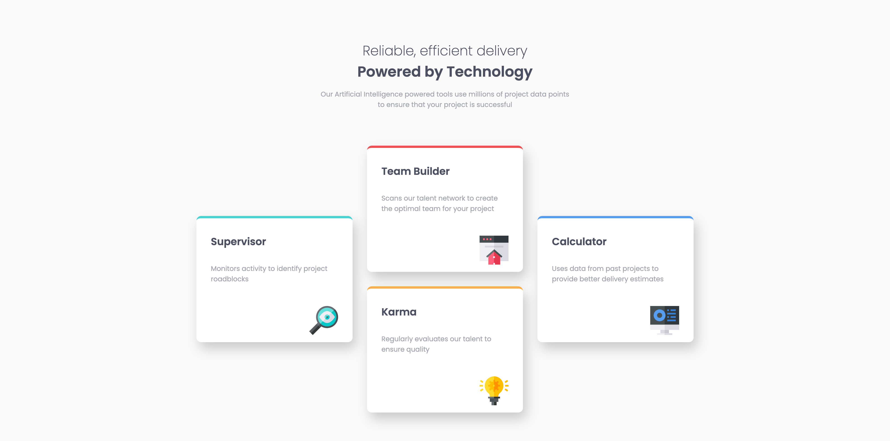

# Frontend Mentor - Four card feature section solution

This is a solution to the [Four card feature section challenge on Frontend Mentor](https://www.frontendmentor.io/challenges/four-card-feature-section-weK1eFYK). Frontend Mentor challenges help you improve your coding skills by building realistic projects.

## Table of contents

- [Overview](#overview)
  - [The challenge](#the-challenge)
  - [Screenshot](#screenshot)
  - [Built with](#built-with)

## Overview

### The challenge

Users should be able to:

- View the optimal layout for the site depending on their device's screen size

### Screenshot

### Links

- Solution URL: [https://www.frontendmentor.io/solutions/fourcardfeaturesectionmaster-rbFSwNjcko]([https://your-solution-url.com](https://www.frontendmentor.io/solutions/fourcardfeaturesectionmaster-rbFSwNjcko))
- Live Site URL: [https://seangray-dev.github.io/four-card-feature-section-master/]([https://your-live-site-url.com](https://seangray-dev.github.io/four-card-feature-section-master/))

### Built with

- Semantic HTML5 markup
- Flexbox
- CSS Grid
